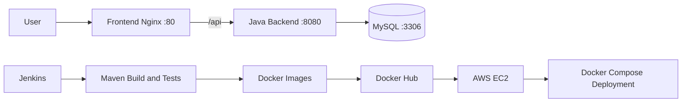

# Java Application CI/CD

A containerized Java application with a static Nginx frontend and MySQL database. This project demonstrates a complete CI/CD workflow using Jenkins, Docker, Docker Compose, Docker Hub, and AWS EC2.

## Architecture



## Technology Stack

- Java 17
- Maven
- JUnit 5
- MySQL 8
- Nginx
- Docker
- Docker Compose
- Jenkins
- Docker Hub
- AWS EC2
- SSH

## Project Structure

```text
.
├── backend/
│   ├── src/
│   │   ├── main/java/
│   │   └── test/java/
│   ├── Dockerfile
│   └── pom.xml
├── frontend/
│   ├── index.html
│   ├── nginx.conf
│   └── Dockerfile
├── docker-compose.yml
├── Jenkinsfile
└── .gitignore
```

## Application Components

### Backend

The backend is a Java 17 Maven application. It:

- Compiles and packages using Maven
- Uses MySQL for database connectivity
- Includes JUnit 5 tests
- Runs inside an Eclipse Temurin Java 17 runtime container
- Exposes port `8080`

### Frontend

The frontend is served using Nginx. It:

- Serves the static `index.html` page
- Exposes port `80`
- Proxies `/api` requests to the backend service

### Database

MySQL runs as a Docker Compose service with persistent storage using a Docker volume.

## Docker Images

The application builds and pushes the following images:

```text
faizan715/cicd-backend:latest
faizan715/cicd-frontend:latest
```

## Run the Project Locally

### Prerequisites

Install the following tools:

- Docker
- Docker Compose v2
- Java 17
- Maven

### Clone the Repository

```bash
git clone https://github.com/faizan715/java-application-CICD.git
cd java-application-CICD
```

### Test and Package the Backend

```bash
mvn -f backend/pom.xml clean test package
```

### Build the Docker Images

```bash
docker compose build
```

### Start the Application

```bash
docker compose up -d
```

### Check Running Containers

```bash
docker compose ps
```

### Access the Application

- Frontend: [http://localhost](http://localhost)
- Backend: `http://localhost:8081`
- MySQL: `localhost:3306`

The available backend API paths depend on the Java source code in `backend/src`.

## Useful Docker Commands

View all logs:

```bash
docker compose logs -f
```

View backend logs:

```bash
docker compose logs -f backend
```

Stop the application:

```bash
docker compose down
```

Stop the application and remove the database volume:

```bash
docker compose down -v
```

> Removing the volume deletes the local MySQL data.

## CI/CD Pipeline

The Jenkins pipeline performs the following steps:

1. Checks out the source code.
2. Compiles the backend using Maven.
3. Runs automated tests.
4. Packages the Java application.
5. Builds the Docker images.
6. Logs in to Docker Hub using Jenkins credentials.
7. Pushes the images to Docker Hub.
8. Connects to a remote AWS EC2 server using SSH.
9. Copies the Docker Compose file to the server.
10. Pulls the latest images and restarts the application.

The pipeline is defined in [`Jenkinsfile`](Jenkinsfile).

## Jenkins Requirements

The Jenkins agent should have:

- Git
- Java 17
- Maven
- Docker
- Docker Compose v2
- Jenkins SSH Agent plugin

Configure the Maven tool in Jenkins with the name expected by the pipeline, or update the name in `Jenkinsfile`.

Configure Jenkins credentials for:

- Docker Hub username and password
- SSH private key for the EC2 server

Make sure the Docker Hub repositories exist before running the pipeline.

## Deploy on AWS EC2

After the Jenkins pipeline copies `docker-compose.yml` to the EC2 server, the deployment uses Docker Compose:

```bash
cd ~/deployment
docker compose pull
docker compose up -d
docker compose ps
```

The EC2 instance must have Docker, Docker Compose, and the required firewall/security-group rules configured.

## Security Notes

Before using this project in a production environment:

- Replace the demo database credentials with secure secrets.
- Do not commit passwords, private keys, or `.env` files.
- Store deployment values in Jenkins credentials or environment variables.
- Replace `StrictHostKeyChecking=no` with proper SSH host-key verification.
- Avoid using the `latest` tag for production deployments.
- Use versioned image tags based on the Jenkins build number or Git commit SHA.
- Add Docker health checks and database readiness checks.
- Replace the fixed backend startup delay with a proper service health check.

## Future Improvements

- Add immutable Docker image tags and rollback support.
- Add Docker image scanning with Trivy.
- Add code-quality and test-coverage reports.
- Add MySQL health checks.
- Add HTTPS using a domain name and TLS certificates.
- Add Prometheus and Grafana monitoring.
- Deploy the application to Kubernetes or Amazon EKS.
- Add automated pull-request validation.
- Add centralized logging and alerting.

## Project Purpose

This project was created as a DevOps learning and portfolio project to demonstrate:

- Containerization
- Maven build automation
- Jenkins CI/CD
- Docker image management
- Remote deployment to AWS EC2
- Multi-container application orchestration with Docker Compose
